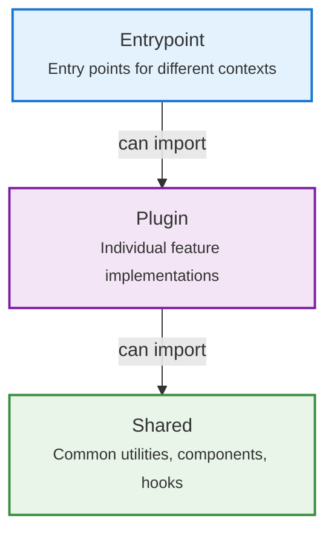

# Architecture

This is a browser extension that heavily modifies (monkey-patches) Perplexity AI web pages to enhance functionality. Modularity is key to the extension's design; in other words, each feature (plugin) should be able to work with as few dependencies as possible.

## Core Architecture Components

### Contexts

The extension operates in FOUR execution contexts:

- **Extension UI** - User interfaces like options page, popup, and sidepanel
- **Background Service Worker** - Long-running script that handles tasks even when the extension UI is not open
- **Content Scripts** - Scripts injected into Perplexity AI web pages to enhance functionality
- **Main-world Content Scripts** - Scripts that run in Perplexity AI web pages' document Javascript context (able to access low level objects like the `next` router, and the React fiber tree)

Communication between these contexts is facilitated by `webext-bridge` (100% type safety).

### Directory Structure

```
src/
├── assets/         # Static assets
├── components/     # Shared UI components
├── data/           # Shared data sources and constants
├── entrypoints/    # Entry points for different contexts
│   ├── background/       # Background service worker
│   ├── content-scripts/  # Content scripts
│   └── options-page/     # Options page UI
├── hooks/          # Shared React hooks
├── plugins/        # Modular feature implementations
│   ├── _api/       # Core Abstractions
│   ├── _core/      # Core Plugins
│   └── */          # Individual plugins
├── services/       # Shared services
├── types/          # Shared TypeScript type definitions
└── utils/          # Shared utility functions
```

## Plugin System

The architecture uses a modular plugin system to implement features independently:

- Each plugin resides in its own directory under `src/plugins/`.
- Plugins can be enabled/disabled. When a plugin is disabled, its side effects should be unloaded and any dependent plugins should also be disabled.
- Plugins use a centralized registry system for discovery, configuration, and dependency management.
  - [Plugin Registry](../src/data/plugin-registry/index.ts)
  - [Plugin Loaders Registry](../src/entrypoints/content-scripts/loaders.ts)
  - [Settings UI](../src/entrypoints/options-page/dashboard/pages/plugins/components/plugin-settings-uis/loader.ts)
  - Refer to [Build your own plugin](./build-your-own-plugin.md) for more details

### Module Discovery

This repository heavily leverages **Vite's `import.meta.glob`** for automatic module discovery and registration. This eliminates the need for manual imports and enables a true plugin architecture where:

- **Plugin Registry**: Automatically discovers all plugin manifests via `@/plugins/!(_core|_api)/index.ts`
- **Content Script Loaders**: Auto-loads plugin loaders via `@/plugins/!(_core|_api)/loader.{ts,tsx}` and `@/plugins/**/*.loader.{ts,tsx}`
- **Settings UIs**: Auto-registers plugin settings components (options-page) via `@/plugins/!(_core|_api)/settings-ui.tsx`
- **Background Listeners**: Auto-registers event listeners via `@/**/*.background-listener.ts`
- **Proxy Services**: Auto-registers background services via `@/services/**/*.proxy-service.ts` and `@/**/indexed-db/index.ts`
- **Internationalization**: Auto-loads locale files via `@/_locales/*.*.ts`, `@/plugins/*/_locales/*.*.ts`, etc.

Create files with the correct naming convention, and they're automatically discovered and integrated into the system without any manual registration steps.

### Plugin Structure

The folder structure is similar to a typical feature-based structure, where each feature folder contains its own components, hooks, services, types, utils, and data:

```
plugins/feature-name/
├── components/   # UI components
├── hooks/        # React hooks
├── index.ts      # Entry point
├── store.ts      # State management
├── utils.ts      # Utility functions
└── types.ts      # Type definitions
```

## Dependency Boundaries

The project enforces strict dependency boundaries via ESLint using `eslint-plugin-boundaries`. The configuration is defined in [`eslint-config/boundaries.js`](../eslint-config/boundaries.js).

### Boundary Types

1. **Shared** - Common code including components, hooks, services, types, utils, and data
2. **Entrypoint** - Entry points for different contexts (background, content scripts, options)
3. **Plugin Core** - Core plugin functionality and APIs (`src/plugins/_api/**/*`, `src/plugins/_core/**/*`)
4. **Plugin** - Individual feature implementations (`src/plugins/*/**/*`)
5. **Plugin Public Exports** - Public API surfaces for plugins (`src/plugins/*/**/*.public.*`)
6. **Plugin Settings UI** - Settings UI components for plugins (`src/plugins/*/**/settings-ui.tsx`)

### Import Rules

Dependency flow is strictly controlled where each boundary type can only import from allowed types:

- **Shared** → `Shared`, `Plugin Core`, `Plugin Public Exports`
- **Entrypoint** → `Entrypoint`, `Shared`, `Plugin Core`, `Plugin Public Exports`
- **Plugin Core** → `Shared`, `Plugin Core`, `Plugin`, `Plugin Public Exports`
- **Plugin** → `Shared`, `Plugin Core`, `Plugin Public Exports`, same plugin only
- **Plugin Public Exports** → same plugin only
- **Plugin Settings UI** → `Shared`, `Plugin Core`, `Plugin Public Exports`, same plugin, `options-page` entrypoint



**Key principle**: Higher layers can import from lower layers, but not vice versa. This prevents circular dependencies and maintains clean architecture.

### File Categorization

Files are categorized based on their location patterns as defined in the ESLint boundaries configuration:

- **Shared**: `src/*.ts`, `src/components/**/*`, `src/assets/**/*`, `src/hooks/**/*`, `src/services/**/*`, `src/types/**/*`, `src/utils/**/*`, `src/data/**/*`, `src/**/index.public.ts`
- **Entrypoint**: `src/entrypoints/*/**/*`
- **Plugin Core**: `src/plugins/_api/**/*`, `src/plugins/_core/**/*`
- **Plugin**: `src/plugins/*/**/*`
- **Plugin Public Exports**: `src/plugins/*/**/*.public.*`
- **Plugin Settings UI**: `src/plugins/*/**/settings-ui.tsx`

### Special Rules

- Plugins can only import from their own plugin directory (same `pluginName`)
- Plugin Public Exports cannot import from their own plugin's public exports (prevents circular dependencies)
- Plugin Settings UI can import from the `options-page` entrypoint specifically
- Files in `**/_locales/**/*` are excluded from boundary checking

## Data

- Persistence via Extension's Storage and IndexedDB

## Technology Stack

See [Tech Stack](./tech-stack.md)
